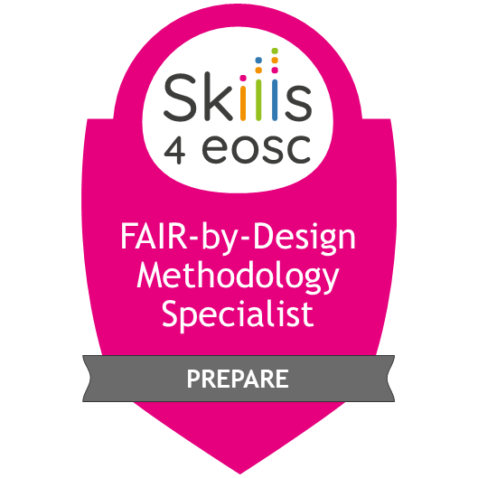

# Training Facilitator Guide

The purpose of this document is to include all necessary information regarding the preparation and planning of the Open Licenses (Data, Code and Software) training.

## Purpose of the training material

This 2-hour long unit provides trainers with the core skills and knowledge to teach the nuances of licensing research outputs. After completing the unit, the trainer will be able to reflect on how to tailor the content to their local environment, and have more knowledge about how and when to apply licenses throughout a project, while complying with funders, institutional requirements and the research discipline/aims of the project.

Licensing is a complex topic, **hence we present a very thorough slide deck covering many aspects of licensing. As this learning path thus has a wealth of slides, and  the instructor should choose which slides best suit a given occasion.**  We leave this slimming down of the content at the discretion of the instructor, and the context and target group in which they are teaching.

## Conducting the training and requirements to the instructor(s)

The training concept is facilitated, discussion led, either online or physical. The material is designed for participants with a basic knowledge of licensing but have the need to discuss with peers and reflect over licensing issues. Accordingly, the trainer needs the ability to be a facilitator and engage participants in discussions. It is not expected the trainer has all the answers and we strongly recommend a "maker approach" to training, where knowledge and learning are created together.

## Resources

- printed handouts (and writing materials)
- projection equipment for the slides

## Before the training
- [ ] Get the latest version of the training materials
- [ ] Send out call for training including the syllabus
- [ ] Prepare for activities (print out handouts)
- [ ] Go through the slides and instructor notes

## During the training

- [ ] Deliver the training
- [ ] Moderate discussions
- [ ] Moderate activities implementation
- [ ] Encourage co-creation, ask others to recommend an action or tool or resource that may be used to accomplish a goal

## After the training

- [ ] Send out a reminder for feedback gathering and badge collecting
- [ ] Gather feedback
- [ ] Analyse feedback
- [ ] Improve the training

## Badges

| Badge | Name | Criteria |
|---|---|---|
| {: style="height:100px;"} | Badge Title | Complete the learning unit and submit the final version of the answers to the activities questions |

## [Learning Activities](./Open%20Licenses%20for%20Data,%20Software%20and%20Code/Activities/activity_details.md)

For more detailed approach you can refer to the recommendations by the TRIPLE project for Open Science training events organisation available [here](https://zenodo.org/record/6256198).

